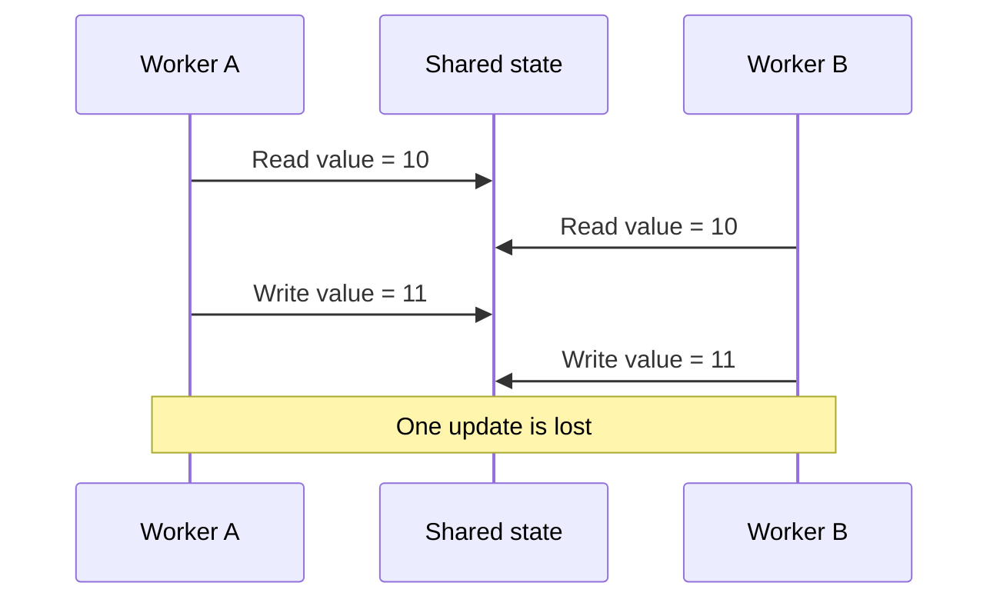

# Race condition

A race condition exists when correctness depends on which concurrent operation happens first.

The problem is not concurrency by itself. The problem is that the invariant depends on an unsafe interleaving.

## Symptoms

Failures are intermittent, load-dependent, or difficult to reproduce. Lost updates, duplicated work, invalid state transitions, and stale decisions are common outcomes.

## Detection

Use stress tests, deterministic concurrency tests where possible, tracing with operation identifiers, and review of shared mutable state. Reproduce the invariant that was violated rather than relying only on timing.

## Mitigation

Protect shared state with an appropriate synchronization or serialization mechanism. Database transactions, optimistic concurrency control, locks, queues, immutable state, or idempotent operations can each fit different boundaries.

:::caution[Define the invariant first]
A lock or transaction is not automatically correct. Identify the state transition that must remain atomic or ordered before choosing a synchronization mechanism.
:::

## Trade-offs

Stronger serialization can reduce throughput or increase contention. Lock-free or highly concurrent designs can improve throughput while increasing reasoning cost.

Do not add synchronization without defining the invariant that it protects.

## Sources

- Maurice Herlihy and Nir Shavit. *The Art of Multiprocessor Programming*.
