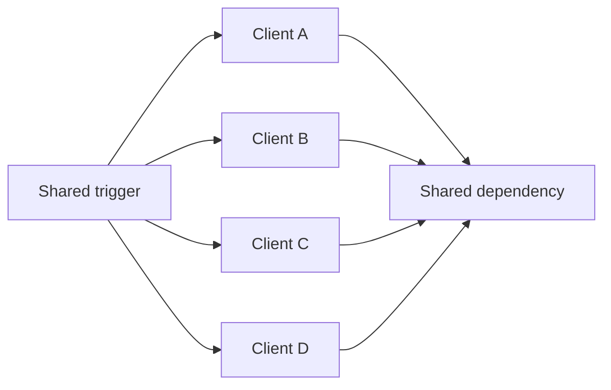

# Thundering herd

A thundering herd occurs when many actors become ready at the same time and hit the same constrained resource.

Common triggers include cache expiry, service recovery, scheduled work, reconnect loops, and release of blocked workers.

## Symptoms

Load arrives as a sharp spike. Latency rises, queues grow, timeouts increase, and the dependency can fail again immediately after recovery.

## Detection

Correlate request volume, cache misses, retries, queue depth, and dependency saturation around the same timestamp.

## Mitigation

Spread work over time with jitter, request coalescing, staggered expiry, bounded concurrency, admission control, or single-flight behavior for shared cache fills.

:::tip[Remove synchronization between clients]
Jitter and staggered expiry are effective because they prevent many independent clients from making the same timing decision at once.
:::

## Trade-offs

Smoothing load can add latency for some callers. Coalescing requires care when requests are not truly equivalent.

## Sources

- Google. *Site Reliability Engineering*, "Addressing Cascading Failures."
