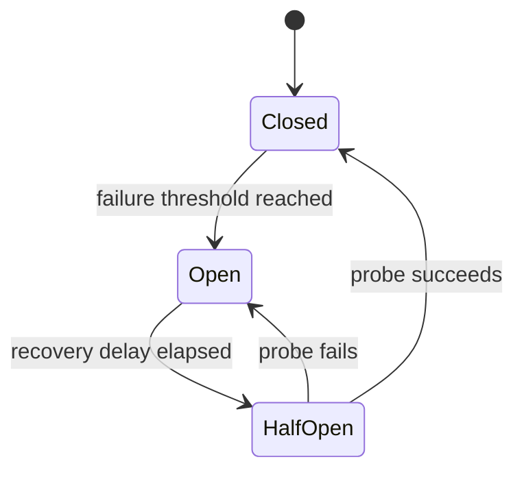

# Circuit breakers

A circuit breaker temporarily stops calls to a dependency when recent failures show that more attempts are unlikely to help.

It protects caller capacity and gives the dependency time to recover.

## Failure mode addressed

A slow or unavailable dependency can cause callers to accumulate waiting work and repeated retries.

If every request continues to call the failing dependency, the failure can consume connection pools, threads, queues, and retry capacity across the system.

## How it works

A circuit breaker normally moves between three states:

In the **closed** state, calls flow normally and failures are observed.

In the **open** state, calls fail fast without contacting the dependency.

In the **half-open** state, a small number of probe calls test whether normal traffic can resume.

:::caution[Fail fast does not mean recover automatically]
A circuit breaker needs a deliberate recovery policy. Sending full traffic immediately after a quiet period can overload a dependency that has only partially recovered.
:::

## Important choices

A breaker policy should define:

- which failures count toward opening;
- the observation window;
- failure or latency thresholds;
- how long the breaker remains open;
- how many half-open probes are allowed;
- what callers receive while the breaker is open;
- whether the breaker is scoped per dependency, endpoint, tenant, or another boundary.

A breaker that combines unrelated dependencies can block healthy work because one failure class affects every call behind the same state.

## Trade-offs and secondary failures

A circuit breaker can reject requests that would have succeeded during partial recovery.

Thresholds that are too sensitive can cause frequent state changes. Thresholds that are too tolerant can allow excessive failing traffic through.

Breakers also add local state. Different caller instances can therefore make different decisions about the same dependency unless state is coordinated.

Coordination can improve consistency but adds its own complexity and failure modes.

## Dangerous combinations

A circuit breaker does not replace timeouts. Calls that are allowed through still need a finite waiting boundary.

It also does not make unsafe retries safe. Retried mutations still need idempotency when duplicate effects are possible.

A half-open breaker combined with many synchronized callers can create a recovery spike. Probe concurrency should remain intentionally small.

## Observability

Track:

- breaker state and state-transition count;
- calls rejected while open;
- failures and latency used by the opening policy;
- half-open probe results;
- time spent in each state;
- downstream health during recovery;
- fallback or degraded-mode usage triggered by the breaker.

State transitions should be visible enough to explain why requests failed without reaching the dependency.

## When a simpler mechanism is enough

A timeout and bounded retry policy can be sufficient when failures are brief and the dependency recovers quickly.

Do not add a breaker when there is no meaningful repeated call path or when failing fast provides no capacity or recovery benefit.

## Sources

- Michael T. Nygard. *Release It! Design and Deploy Production-Ready Software*. Pragmatic Bookshelf.
- Microsoft. "Circuit Breaker pattern." Azure Architecture Center.
