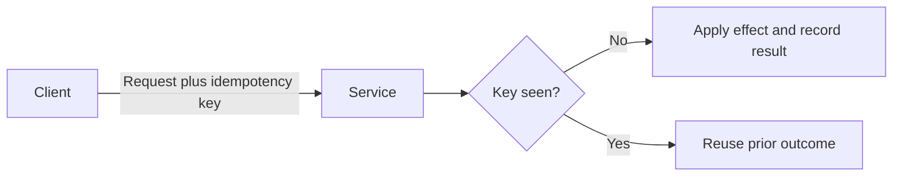

# Idempotency

An idempotent operation can receive the same logical request more than once without applying the intended effect more than once.

This property is important when a caller cannot tell whether an earlier attempt succeeded.

## Failure mode addressed

Distributed systems can duplicate work even when every component behaves correctly.

A caller can send a request, the server can commit the change, and the response can be lost. The caller then sees a timeout and cannot know whether retrying will repeat the side effect.

Duplicate message delivery and worker restarts create the same problem.

## How it works

For naturally idempotent operations, repeating the same operation already has the same intended effect.

For non-idempotent mutations, a common design uses an idempotency key that represents one logical request.

The service associates the key with the logical operation and remembers enough state to recognize later duplicates.

:::caution[The key must represent intent]
Reusing one idempotency key for different operations is a contract violation. Define the key scope, request identity, and retention window explicitly.
:::

## Important choices

An idempotency contract should define:

- who creates the key;
- which caller or resource scopes the key;
- which request fields must match on reuse;
- how long the key is retained;
- what response is returned for a duplicate;
- how concurrent requests with the same key are handled;
- how the recorded key and side effect remain consistent.

The last point is difficult when recording duplicate state and applying the effect cannot be one atomic operation.

## Trade-offs and secondary failures

Idempotency adds storage, lookup, retention, and concurrency costs.

A retention window that is too short can allow a late duplicate to execute again. A window that is too long can retain unnecessary state or prevent legitimate reuse when key scope is poorly designed.

A client-generated key also requires validation. The same key with materially different parameters should not silently become a different operation.

Idempotency prevents duplicate effects only within the guarantees of its contract. It does not provide a general exactly-once execution guarantee across unrelated systems.

## Dangerous combinations

Retries of non-idempotent mutations can duplicate charges, resource creation, notifications, or other side effects.

A timeout makes this risk more visible because the caller may not know whether the remote operation committed before the timeout occurred.

Adding an idempotency key without atomic duplicate detection can still allow concurrent duplicates through a race.

## Observability

Track:

- first-seen and duplicate requests separately;
- idempotency-key conflicts;
- concurrent requests for the same key;
- duplicate requests outside the retention window when detectable;
- failures between effect execution and idempotency-state persistence;
- latency added by duplicate detection.

Duplicate rates can reveal unstable networks, aggressive retry policies, or repeated message delivery upstream.

## When a simpler mechanism is enough

Do not build a key store when the operation is naturally idempotent and its existing semantics already make retries safe.

For local code with exactly one controlled caller and no duplicate-delivery path, normal transaction boundaries can be enough.

## Sources

- IETF. *RFC 9110: HTTP Semantics*, Section 9.2.2, "Idempotent Methods."
- Malcolm Featonby. "Making retries safe with idempotent APIs." Amazon Web Services.
