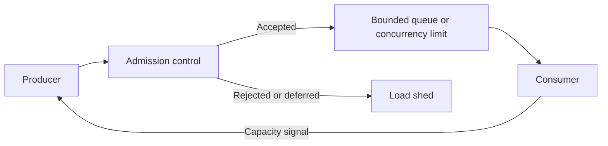

# Load shedding and backpressure

Backpressure slows or constrains producers when consumers cannot keep up.

Load shedding deliberately rejects, drops, or de-prioritizes work when accepting more work would harm the system.

Both mechanisms keep overload bounded instead of allowing queues and latency to grow without control.

## Failure mode addressed

When incoming work exceeds sustainable capacity, unbounded acceptance creates queues.

Queues consume memory and increase latency. Long waits then trigger timeouts and retries, which can add even more work.

If the overload continues, a local capacity problem can become a cascading failure.

## How it works

A system can control overload at several boundaries:

Backpressure communicates available capacity upstream so producers can reduce or delay work.

Load shedding rejects work that should not enter the constrained path.

Useful mechanisms include bounded queues, concurrency limits, rate limits, admission control, demand signaling, prioritization, and explicit rejection.

:::caution[An unlimited queue is delayed failure]
A queue can absorb short bursts, but an unbounded queue turns overload into growing latency and memory use. Bound the queue and define what happens when it is full.
:::

## Important choices

The design should define:

- which resource represents the real capacity limit;
- where admission decisions occur;
- how much queueing is acceptable;
- which work can be rejected, delayed, or degraded;
- how priority is assigned;
- how producers receive capacity or rejection signals;
- whether callers should retry rejected work and under what conditions.

The best boundary is often before expensive work begins.

## Trade-offs and secondary failures

Load shedding preserves system health by sacrificing some work.

A policy that sheds too early reduces useful throughput. A policy that sheds too late may not protect the constrained resource.

Backpressure can propagate latency upstream. If producers cannot slow down, pressure can move into another queue instead of disappearing.

Priority systems can also starve low-priority work when overload lasts for a long time.

## Dangerous combinations

Load shedding combined with immediate client retries can create a retry storm. Rejection must not become a signal to retry without delay or limit.

Backpressure that is ignored by one producer does not protect the consumer from that producer's load.

Large queues combined with long timeouts can hide overload until latency is already unacceptable.

Recovery after a shared overload event can also trigger a thundering herd if many blocked clients resume at once.

## Observability

Track:

- admitted, rejected, dropped, and deferred work separately;
- queue depth and queue wait time;
- active concurrency;
- saturation of the protected resource;
- backpressure or demand signals;
- shed rate by priority or request class;
- retry volume caused by rejection;
- latency before and after admission control.

A healthy shedding policy can increase explicit rejections while preventing a larger rise in timeouts and resource exhaustion.

## When a simpler mechanism is enough

A small system with naturally bounded concurrency may only need a fixed worker pool and a bounded queue.

Do not add a complex adaptive admission controller when a clear static capacity limit and explicit rejection policy are sufficient.

## Sources

- Google. *Site Reliability Engineering*, "Addressing Cascading Failures."
- Reactive Streams. "Reactive Streams."
