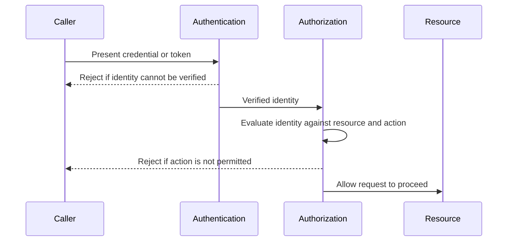

# Authentication vs authorization

Authentication establishes who or what is acting. Authorization decides what that established identity is allowed to do. A system needs both, and confusing one for the other creates access-control gaps.

## The problem it addresses

A verified identity does not by itself imply any specific permission. A system that stops checking after authentication effectively grants every authenticated identity the same access, regardless of role, ownership, or task.

The reverse gap also occurs: a system can enforce careful authorization rules while trusting an identity that was never properly verified, making the authorization decision meaningless.

## The mechanism

Authentication and authorization are separate decisions that normally happen in sequence for a given request.

Authentication answers "is this identity who it claims to be." Authorization answers "is this identity allowed to perform this specific action on this specific resource."

Both checks can fail independently. A request must pass both before it proceeds.

OAuth 2.0 (RFC 6749) is an authorization framework: it lets a client obtain limited, delegated access to a resource. It does not itself authenticate the resource owner.

OpenID Connect adds an identity layer on top of OAuth 2.0 specifically to address authentication, using an ID token that a client can verify.

## Trust boundaries and scope

Authentication establishes trust at the boundary where a request enters the system.

Authorization applies at every subsequent boundary where a specific action touches a specific resource. It should run again for each such boundary rather than being assumed from the entry check.

A system that authorizes only once, at entry, cannot express distinctions that matter later, such as one authenticated identity having different permissions for different resources it might reach during the same session.

## Trade-offs

Checking authorization on every request, for every resource, adds latency and requires the authorization data to be available and current at each check.

Caching that data can reduce cost but risks acting on a stale permission if a grant was recently revoked.

Coarse authorization, such as one role granting access to an entire resource class, is cheaper to implement and reason about, but it grants more than most individual actions need.

## Failure modes and misuse

Common ways this distinction breaks down in practice:

- treating a valid session or token as proof of permission for every action it later requests;
- checking authorization once at the start of a workflow and reusing that result for later steps that need a separate check;
- authorizing an object type in general instead of the specific object instance a request targets, allowing access to any record of that type;
- a time-of-check-to-time-of-use gap, where authorization is checked and the permission changes before the authorized action actually executes.

:::caution[Re-authorize at time of use, not only at time of check]
An authorization decision can become stale between the check and the protected action, especially across asynchronous steps. This is a specific case of a race condition and needs the same discipline about atomicity or re-verification.
:::

## Relationship to other practices

Authorization is the enforcement point for least privilege: it decides, request by request, whether the granted scope covers the requested action.

Authentication failures and authorization failures should both fail closed by default rather than defaulting to access.

## Sources

- IETF. *RFC 6749: The OAuth 2.0 Authorization Framework*.
- OpenID Foundation. *OpenID Connect Core 1.0*.
- OWASP. "Authorization Cheat Sheet." OWASP Cheat Sheet Series.
