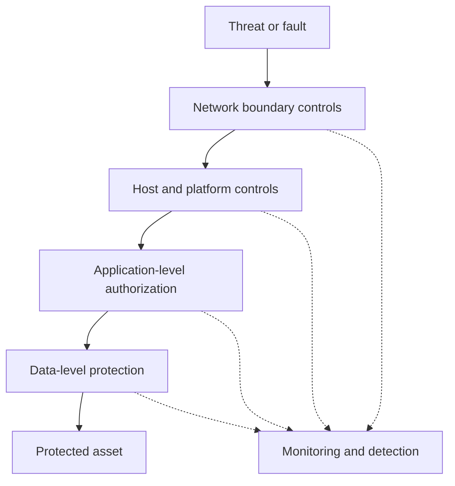

# Defense in depth

Defense in depth layers independent controls so that the failure or bypass of one control does not by itself expose the protected asset.

## The risk it addresses

A system that relies on a single control has a single point of failure for that risk.

If the control has a defect, is misconfigured, or is bypassed, nothing else stands between the threat and the asset.

Layered controls reduce this risk by requiring an attacker, or a fault, to defeat more than one independent mechanism before reaching the same asset.

## The mechanism

Each layer addresses the same risk from a different position or with a different technique, so that a shared flaw is unlikely to defeat every layer at once.

Monitoring runs across the layers rather than as one more barrier in the same path.

It does not stop an attempt, but it makes a partial breach visible so a response can happen before every layer fails.

## Trust boundaries and scope

Each layer should represent an independent trust boundary with its own enforcement point, not a repeated check of the same underlying mechanism.

A firewall rule and an application allowlist that both depend on the same misconfigured source list are one control duplicated, not two independent layers.

Layer selection should follow a threat model. Layers that do not address a plausible threat add cost without reducing risk for that threat.

## Trade-offs

Every layer adds operational cost: more components to configure, monitor, patch, and reason about during an incident.

Layers can also interact in ways that are hard to predict. A layer added without analysis can create new failure paths instead of closing existing ones.

Defense in depth is not free redundancy. Each layer needs its own justification, tied to a specific risk it reduces.

## Failure modes and misuse

Common ways defense in depth fails to deliver its intended benefit:

- layers that share the same underlying dependency or misconfiguration, so one root cause defeats all of them;
- treating a large number of controls as proof of security without checking whether any control addresses the actual threat;
- gaps between layers where no control has clear ownership;
- alert fatigue from monitoring across many layers, which delays response to a real breach.

:::caution[More layers is not automatically more secure]
A control added without a clear threat and a clear failure mode it closes is security theater. It adds cost and complexity without a corresponding reduction in risk.
:::

## Relationship to other practices

Defense in depth organizes several other principles into layers instead of treating them as one decision. Least privilege limits what any single compromised layer can reach.

Secure defaults keep each layer closed unless explicitly opened. Threat modeling identifies which layers a specific system actually needs and where a layer is missing or redundant.

## Sources

- National Institute of Standards and Technology. Computer Security Resource Center Glossary, "defense-in-depth" (sourced from CNSSI 4009).
- National Institute of Standards and Technology. *NIST Special Publication 800-53 Revision 5: Security and Privacy Controls for Information Systems and Organizations*.
