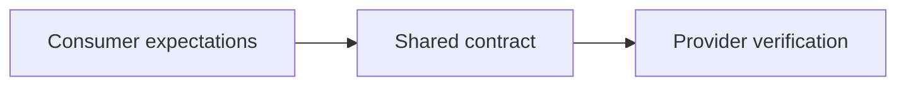

# Contract testing

Contract testing verifies that two independently changing components agree on the messages or interactions at their boundary.

The contract can describe HTTP requests and responses, message payloads, protocol rules, or another externally visible interaction.

The test focuses on compatibility at the boundary. It does not replace functional testing inside either component.

## Problem

A consumer can pass all local tests against a test double and still fail in production because the real provider changed or the double was inaccurate.

A broad end-to-end environment can detect some of these mismatches. It can also be slow, difficult to coordinate, and expensive to keep representative.

Contract testing moves compatibility checks closer to the integration boundary.

:::caution[Contract tests do not prove the whole workflow]
A compatible request and response contract does not prove that the provider implements the correct business behavior or that the complete user journey succeeds.
:::

## What is actually verified

A contract test verifies agreed interaction properties that matter to compatibility.

These can include:

- request shape and required fields;
- response shape and status behavior;
- message schema and metadata;
- compatibility expectations used by a consumer;
- provider support for documented interactions.

Avoid asserting fields or ordering that consumers do not depend on. Overly strict contracts increase coordination cost without adding useful protection.

## Consumer-driven contracts

In a consumer-driven model, consumers express the interactions they actually require. Providers verify that they can satisfy those expectations.

This can reduce unnecessary coupling to provider features that no current consumer uses.

It also creates a coordination requirement. Contract versions and verification results must be available where release decisions need them.

## Appropriate boundaries

Contract testing is useful when:

- components are developed or released independently;
- a consumer relies on an API or message boundary;
- local tests use doubles for the remote component;
- broad end-to-end tests are too costly to cover every compatibility case;
- breaking interface changes are an important delivery risk.

It is less useful for a private in-process function boundary that changes atomically with its callers.

## Strengths and limitations

Contract tests can provide faster and more focused compatibility feedback than a fully deployed end-to-end environment.

They can support independent release decisions and make integration assumptions explicit.

They do not verify production networking, deployment configuration, shared infrastructure, or full workflow semantics unless those properties are explicitly part of the tested contract.

## Failure modes

Common problems include:

- treating contract tests as provider functional tests;
- asserting every field instead of consumer-relevant behavior;
- publishing contracts without verifying them against provider versions;
- allowing stale contracts to remain in release decisions;
- assuming schema compatibility guarantees semantic compatibility;
- keeping contract tests while also maintaining identical broad tests with no additional purpose.

## Maintenance and delivery cost

Contract testing moves some cost from shared test environments into contract publication, versioning, verification, and release coordination.

That trade can be valuable when several independently changing components share a boundary. It is not free infrastructure and should solve a real coordination problem.

## Sources

- Martin Fowler. "Contract Test." 2011, revised 2018.
- Pact Foundation. *Pact documentation: Introduction*.
