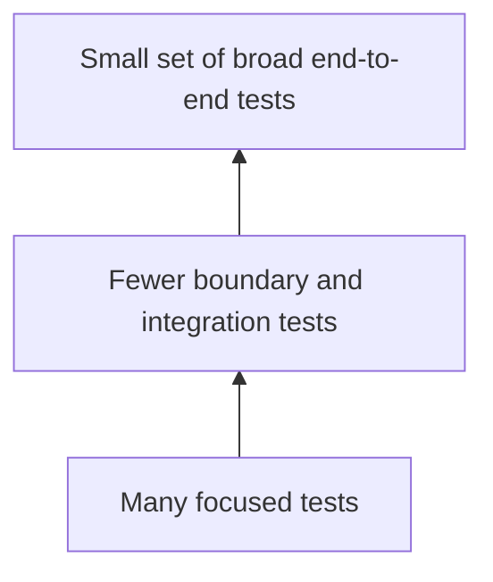

# Testing strategy

A testing strategy defines where automated verification should provide confidence and how much cost the team accepts for that evidence.

The testing pyramid is one useful model. It suggests many fast, focused tests and fewer broad tests that exercise large parts of the system.

The shape is guidance, not a required ratio. Different systems have different risks, boundaries, and execution costs.

## Problem

A suite can contain many tests and still provide poor feedback.

Too many broad tests can make changes slow to verify and failures difficult to diagnose. Too many isolated tests can leave important integration and deployment risks unverified.

A useful strategy chooses test scopes based on the failure modes that matter.

:::tip[Optimize for evidence, not test counts]
Do not target a fixed percentage of unit, integration, and end-to-end tests. Add the cheapest credible test for each important risk.
:::

## Strategy factors

Consider:

- how quickly developers need feedback;
- how expensive the test environment is to create and maintain;
- how easily a failure points to its cause;
- which boundaries are technically or organizationally risky;
- which behavior can be verified cheaply at a small scope;
- which failures only appear when real components are connected;
- how often the test can run in the delivery pipeline;
- whether the result is deterministic enough to gate changes.

A test is valuable when it provides evidence that changes a release or engineering decision.

## A layered portfolio

Focused tests can verify algorithms, policies, state transitions, validation, and local edge cases quickly.

Boundary and integration tests can verify persistence, serialization, external protocols, framework adapters, and contracts between independently changing components.

Broad end-to-end tests can verify a small set of critical assembled paths.

Contract tests can reduce the amount of broad testing needed for independently deployed integrations. They do not eliminate the need to verify deployment and workflow risks where those risks matter.

## Alternatives to a literal pyramid

Some systems naturally need a different shape.

A thin client over a stable platform can gain more value from integration-level tests than from a large set of isolated UI unit tests.

A compiler, parser, or calculation library can often cover most important behavior with fast focused tests.

A distributed system can need more contract, component, and infrastructure testing because important failures occur at boundaries.

The model should follow the architecture instead of forcing the architecture into a test taxonomy.

## Failure modes

Common problems include:

- treating the pyramid as a fixed numerical ratio;
- measuring strategy by test count instead of covered risk;
- duplicating the same scenario at every level without added evidence;
- pushing all confidence into slow end-to-end suites;
- mocking important boundaries so thoroughly that integration failures remain invisible;
- allowing flaky tests to remain release gates;
- keeping expensive tests that no longer affect engineering decisions.

## Maintenance and execution cost

Every test consumes maintenance effort. Broad tests usually have more environmental dependencies, while focused tests can become numerous and tightly coupled to implementation details.

Remove or simplify tests whose evidence is already provided more cheaply elsewhere. Keep overlapping tests when they protect different risks.

Place fast, high-signal tests early in the feedback loop. Run slower or more environment-heavy tests at a cadence that still detects failures before the relevant release decision.

## Sources

- Martin Fowler. "Test Pyramid." 2012.
- Ham Vocke. "The Practical Test Pyramid." 2018.
