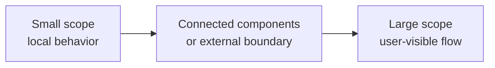

# Unit, integration, and end-to-end tests

Unit, integration, and end-to-end tests describe different verification scopes. The names are useful only when the team also defines the boundary each name represents.

The scope generally grows from left to right. Execution cost, environment needs, and failure diagnosis often grow with it.

## What each scope verifies

A unit test verifies behavior inside a small, deliberately chosen unit. A unit can be a function, class, module, or small collaboration of types.

An integration test verifies that separately designed parts work correctly at a boundary. The scope can be narrow, such as one database adapter against a real database, or broader.

An end-to-end test verifies a large system path through several real components. It usually checks a user-visible or externally visible outcome.

:::note[Define the boundary, not only the label]
"Integration test" can describe very different scopes. State which components are real, which are replaced, and which boundary the test verifies.
:::

## Appropriate scope

Prefer the smallest scope that can provide credible evidence for the risk being tested.

Use a unit test when the important behavior is local and collaborators do not need to be verified together.

Use an integration test when correctness depends on a boundary such as persistence, serialization, a framework adapter, a message transport, or another service contract.

Use an end-to-end test when confidence depends on the assembled system and a realistic path across its main components.

## Strengths and limitations

Small-scope tests are usually fast and easy to diagnose. They can cover many cases cheaply. They cannot prove that separately tested parts are wired together correctly.

Integration tests verify real boundaries and can find errors in configuration, mapping, protocols, or infrastructure assumptions. They need more setup and can fail for more reasons.

End-to-end tests exercise important assembled behavior. They can detect wiring and workflow failures that smaller tests miss. They are usually slower, harder to isolate, and more expensive to maintain.

## Failure modes

Common problems include:

- calling every test with a database an integration test without defining the verified boundary;
- replacing so many collaborators that the test no longer verifies a meaningful integration;
- using end-to-end tests to cover every input combination;
- asserting internal implementation details in broad tests;
- depending on remote systems whose instability is unrelated to the behavior under test;
- treating one test scope as inherently more valuable than the others.

## Execution and maintenance cost

Cost is not only runtime. Consider fixture setup, environment provisioning, debugging time, data cleanup, network dependencies, and how often a test can run.

Fast tests can provide feedback on every small change. Slower tests can still be valuable when they verify risks that cheaper tests cannot cover.

The test suite should combine scopes so that expensive tests add evidence rather than repeat large amounts of behavior already verified at cheaper levels.

## Sources

- Martin Fowler. "Unit Test." 2014.
- Martin Fowler. "Integration Test." 2018.
- Martin Fowler. "Broad Stack Test." 2013.
